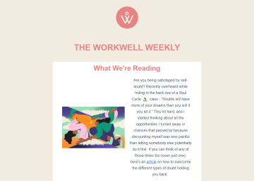

# WorkWell Weekly Newsletter

# Completed Work


# Original Email
Click the preview below to view the original email

<a href="./img/original-email.png" ></a>

# Notes

## CSS-Class element
A quirk about this framework is the ability to change css properties for media queries. I cann't find it, so I have to do this the old fashioned way - using a CSS Media query. What I'm focusing on is the first image under the "What We're Reading" header. It has a padding on the left in the desktop version. When switched to mobile, the padding remains. 
Here is the code to fix this issue, which includes using the `css-class` attribute. I decided to add a unique class to that picture to target it.

```mjml
<mj-column vertical-align="middle" width="300px">
    <mj-image src="./img/art.png" alt="Artwork" padding="0 0 0 30px" css-class="artwork" />
      
</mj-column>

```
@media only screen and (max-width:480px){
    .artwork{
        padding:0 0 20px 0 !important;
    }
}

```css

## Vertical Alignment within MJML
Seems like in order to achieve the middle style vertical alignment, **all** the columns in the "affected" area need to also have the same style `vertical-align=middle` added to the mj-column element

[See Here for Example](https://mjml.io/try-it-live/wvegjOqTmL8)

[See here for the discussion](https://github.com/mjmlio/mjml/issues/1455)

```mjml
 <mj-section background-color="#fff">
                 <mj-column width="300px" vertical-align="middle">
                    <mj-image src="./img/art.png" alt="Artwork" />
                    
                </mj-column>
                <mj-column width="300px" vertical-align="middle">
                    <mj-text line-height="2"  align="center">
                        Are you being sabotaged by self-doubt? Recently overheard while hiding in the back row of a Soul Cycle  🚴‍♀️  class - "Doubts will have more of your dreams than you will if you let it." This hit hard, and I started thinking about all the opportunities I turned away or chances that passed by because discounting myself was less painful than letting somebody else potentially do it first. If you can think of any of those times too (even just one), here's an article on how to overcome the different types of doubt holding you back. 
                    </mj-text>
                </mj-column>
            </mj-section>
```

In the case above, there are 2 columns, and I wanted the picture to be in the middle of the column. At first, I was only targeting the first column, but the second column was by default, set to **top**. Once I set both columns to `vertical-align=middle`, it achieved the desired style.

## Setting Width for the content container
By setting the `mj-body` tag with a new width value, you can override the default 600px width of the email's body. This is a requirement for this particular newsletter, as the original is set to a width of 640px.

## Footer
To include a footer, simply use the `include` tag.
**Important** Seems like the font-sizing wasn't respected when added directly to the `mj-text` element, so adding those properties to the CSS fixed the issue.

```mjml
<!-- Inside the main template-->
<mj-include path="./footer.mjml" />

<!-- The footer itself-->
<mj-section background-color="#ffffff">
    <mj-column>
        <mj-social padding-top="0" padding-bottom="0">
            <mj-social-element src="./img/facebook.png" icon-size="30px" href="https://www.facebook.com">
            </mj-social-element>
            <mj-social-element src="./img/instagram.png" icon-size="30px" href="https://www.instagram.com">
            </mj-social-element>
            <mj-social-element src="./img/linkedin.png" icon-size="30px" href="https://www.linkedin.com">
            </mj-social-element>
        </mj-social>
        <mj-text align="center" font-family="Arial, sans-serif" font-size="12px" line-height="1.4">
            <p class="footer-text"><a href="https://www.weworkwell.io/" target="_blank">Unsubscribe</a> | Sent by WorkWell
            <br>
            1267 Willis Street, Suite 200 • Redding, CA • 96001
            </p>
        </mj-text>
    </mj-column>
</mj-section>
```